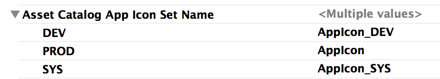
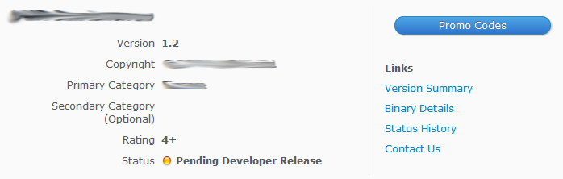

# Pipe Dreams

^ Big finance corporates as their Mobile Tech Lead

^ 18 months - iPhone, Android and iPad apps

^ Version of a blog post

---

# Enterprise Development - Yay!

* Environments are a dime a dozen
	* DEV, SYS, SIT, UAT, DR, PROD, ...
* Affects your testing teams
* Production support (call centre and tech)

^ Not unique to big corporates

^ Testers to be have apps for multiple environments at the same time

^ Easily be able to distinguish between them

^ Quickly see how up-to-date their current app is.

^ Build system that delivers something that is supportable.  

^ eg. provide the information that our call centre needs to assist the customer? 

^ eg. a) Which build the user has, and b) be able to accurately determine how the problem occurred.

---

# Basic techniques

^ Depends on three key techniques

^ A quick overview before I get into it

---

# #1 - Configurations/Schemes

A configuration is a collection of compiler settings

* Optimization flags
* Code signing / provisioning
* Asset catalogs
	 


^ Big sack of compiler settings.  

^ Familiar with Xcode's Debug and Release

^ We clone these to create a configuration for each of our environments.

^ Warning... UAT builds to be as close to possible as production, cloned from Release.

^ Strips debug symbols by default, and I end up spending 20 minutes trying to figure out why the Xcode debugger couldn't match line numbers properly.

---

# #1 - Configurations/Schemes

A scheme determines which configuration and runtime settings will be applied to your target for various activities such as Running, Profile, Archiving, etc.


^ A scheme is the way Xcode maps which configuration gets used

^ As many schemes as we have environments (or configurations).

^ The scheme screenshot that you can see is for our DEV environment, so you'll note that we are using the DEV configuration everywhere.

---

# Schemes In Action


^ How does this bad boy look for developers?

---

# #2 Info.plist preprocessing

* Facilitates variable substitution into **Info.plist** file
* Relevant **Build Settings**:
	* Preprocess Info.plist file
	* Info.plist Preprocessor Prefix File


^ Familiar with our old-friend, the Info.plist file

^ Tell Xcode the name of a .h file that it will read the variables from

^ At build time Xcode will pick up whatever is in that file and substitute it into your Info.plist file.

---

# Modifying Info.plist

```c
	#define XXX_ENVIRONMENT_VERSION   2.4
	#define XXX_ENVIRONMENT_APP_NAME  DEV
```


^ Defined two variables and set them to two values.

^ Info.plist already supports reading variables from your build settings using the Dollar/Curly brace notation.  

^ If you need to dynamically generate values (eg. using a script) then you need to use preprocessing.

^ Facilitates updates to Info.plist without dirtying your workspace

---

# #3 Build Script

Create an aggregate target that contains a Run Script


^ Execute some script commands using the Run Script in your target's build phase

^ Runs too late. 

^ Create an Aggregate Target (the little target icon) that just contains a single Run Script.  

^ To get it to run first, we edit your target's dependencies

---

# Run Script


```sh
	env=${XXX_ENVIRONMENT}
	if [ -z "$env" ]
	then
		env="DEV"
	fi
	preprocessFile="environment_preprocess.h"
```

^ Know which environment your build script is running in, so we create a User-Defined variable called XXX_ENVIRONMENT.  

^ Create this at your Project level

^ Pull XXX_ENVIRONMENT out and set a shell variable called env.  We can use this value later.

^ Set a variable to the name of the Info.plist preprocessing header

---

# A Tester's Device

* Different apps
* Different bundle identifiers
* Visually recognizable icons
* App name confirms environment
* App name contains date of build


---

# Bundle Identifier

Create user-defined variable in Target's configuration


^ Clearly, we'll need different bundle identifiers.

^ Info.plist preprocessing vs Build Setting - no choice.

^ Xcode does some validation (checking code signing certificates) very early on and it occurs even before our Build Script has had a chance to run.

^ As a quick sidebar, my general rule of thumb is to use the Build Settings where the values are simple and don't need to be derived or calculated in any way. 

^ We use .PROD. Symmetry and grepping logs easier, but leaking meta info about our build process.  

---

# Bundle Identifier (cont)

Set Bundle Identifier field in `Info.plist`	


^ Literally as simple as setting the bundle identifier in the Info.plist.  

^ Note curly braces

---

# Setting App Icon

Create an AppIcon entry in your Asset Catalog for each environment and assign to the appropriate configuration.

 



^ We use Asset Catalogs

^ Create an AppIcon entry for each environment.

^ Modify the App Icon Set Name field in configuration 

^ If you aren't using Asset Catalogs, substitute the image name into your Info.plist file (similar to what we did for the bundle identifier).

---

# Setting App Name

* App name *could* simply be changed using a variable in the appropriate Xcode configuration 
* Currency indicator is important


* Use Build Script to modify

^ We wanted to be able to tell how current the app is. 

^ Toyed with a few other indicators, but settled on the day of the month

^ Simple modification to the Build Script.

---

# Setting App Name (cont)

* Add pre-processed variable name to **Info.plist**


* Use Run Script to populate variable

```sh
	appName="MyApp"
	if [ "$env" != "PROD" ]
	then
		todaysDay=`date "+%d"`
		appName="${XXX_ENVIRONMENT} $todaysDay"
	fi
	echo -e "#define XXX_ENVIRONMENT_APP_NAME $appName" >> $preprocessFile
```

^ First pre-processor variable

^ Change the Info.plist to reference the variable.  Note - no dollar/curly brace notation 

^ We default the appName variable to your real app name

^ If building for a non-prod environment, we change it

^ Lastly write this out into the preprocess file that we defined a little bit earlier

^ Let's talk about something different

---

# Version Number

Info.plist contains two version numbers:

* `CFBundleShortVersionString`
* `CFBundleVersion`

Different approaches for non-production (git commit hash) vs. production (same value).


^ CFBundleShortVersionString is what the user sees

^ CFBundleVersion is supposed to be an ever increasing number that represents your build number. 

^ CFBundleShortVersionString is easy.  The question is what we put into CFBundleVersion. 

^ We have two different approaches for non-production and production.  

^ In non-prod, we put the current git commit hash. 

^ 1/ Both TestFlight and Hockey conveniently display in their download page, 

^ 2/ when we dump logs, we have a very easy way that a developer can determine which build a tester is using.

^ Production is a different matter though. 

^ Can't use the commit hash because it has to be numeric,

^ Could use git commit count, but is it meaningful.

^ Same value as is in CFBundleShortVersionString

---

# Version Number (cont)

* Add pre-processed variable name to **Info.plist**


* Use Run Script to populate variable

```sh
	version=`/usr/libexec/PlistBuddy -c "Print :CFBundleShortVersionString" "${PROJECT_DIR}/${PROJECT_NAME}/Info.plist"`
	if [ "$env" != "PROD" ]
	then
		version=`git log --pretty=format:"%h" -1`
	fi
	echo -e "#define XXX_ENVIRONMENT_VERSION $version" >> $preprocessFile
```

^ Again, we modify the info.plist to contain a reference to a variable name.

^ Default value to the same as the CFBundleShortVersionString 

^ Overwrite it in the non-production environments with the commit hash.

^ Enough with the meta data...

---

# Application Settings
* Every app has a set of values that vary by environment:
	* Remote server name
	* Logging level
	* API keys (eg. HockeyApp)
	* Feature availability toggling
	
^ Up until now, we've mostly been dealing with meta data about the app. What about configuration settings that the app requires to operate? Some really basic ones are ...

---

# Application Setting Requirements

* **Never** leak non-production settings
* Switching environments should not dirty workspace
* Environment settings should be under source control

^ Never let our non-prod settings get shipped

^ A developer shouldn't have to modify a file

^ Settings should be checked into source control so that developers and our build box all use the same settings.

---

# Environment .plist files

* Create one plist per environment (add to git, do **not** add to target). For example, `environment_DEV.plist`
* Create empty file called `environment.plist` (do **not** add to git, add to target)
* Build process copies `environment_XXX.plist` on top of `environment.plist`

```sh
	config=${PROJECT_DIR}/${PROJECT_NAME}/config
	cp $config/environment_$env.plist $config/environment.plist
```

^ Read its settings from a file called environment.plist

^ Injected into the bundle at build time by the build script.

^ Create a plist per environment, but don't add them to your target. This stops these files getting shipped in your app.  

^ Touch an empty file called environment.plist that you do add to your target, but you also add it to your gitignore file.  

^ Build script simply copies the relevant plist over the top of the empty environment.plist.

^ Really simple.

---

# Maintaining Environment

Reading settings is simple:

	NSDictionary *plist = [NSDictionary dictionaryWithContentsOfFile:[[NSBundle mainBundle] 
	                                                 pathForResource:@"environment"
	                                                          ofType:@"plist"]];
	NSString *someValue = plist[@"someKey"];

Consider adding service to fetch updated settings

^ Read from the environment.plist just you would any other plist in your bundle.

^ 5 mins after go-live, really useful to be able to change these settings.  

^ Create a Configuration object that reads in the data from the environment.plist on startup, 

^ Kicks off a background thread to go see if any of the settings have changed.

^ Race condition between when the app starts between out-of-box settings and updated settings.  

^ Future enhancement we're looking at is to store the settings in NSUserDefaults so that the app always runs with the most recent settings.

---

# Continuous Integration

```
	/usr/bin/xcodebuild 
		-scheme SYS 
		-configuration SYS 
		-sdk iphoneos 
		-project XXX.xcodeproj 
		clean 
		build 
		"CODE_SIGN_IDENTITY=iPhone Distribution: Some identity" 
		ONLY_ACTIVE_ARCH=NO
```

^ Normal CI build process. 

^ Specify the scheme and configuration on our jenkins server

^ Builds in exactly the same way it does on the developer's machine

^ Almost done... a couple of closing remarks.

---

# Logging

* NSLog is of little use to production support
* Consider adding functionality to capture and send logs
* Must test diagnosing based on production-level logs
	* User navigation (incl. backgrounding)
	* Remote calls
	* Messages 
* http://github.com/edwardaux/BDLogger

^ Dumping stuff out via NSLog is of little value to our production support... the user isn't going to send their phone in to hook up to Xcode.

^ Feature in the Contact Us section where the user can press a button - gives them back a reference number that is generated by our server. 

^ 1) in production it gives our prod support team a chance to see what is happening

^ 2) during testing, testers can add reference number to defect.

^ Logging levels are a bit of a double-edged sword. 

^ During development, it is fantastic to have the app logging at DEBUG level

^ In the production app, you won't (or at least, you shouldn't) have debug logs turned on. 

^ So, you need to make sure that the info that gets logged out at production log setting is sufficient for your prod support guys to figure out what happened.

^ Open-source project that I wrote for my own stuff

^ Logs to a very small sqlite database, purges old records, easy query access 

---

# Going Live

* Nerve wracking
* Difficult to test things like push notifications before being live
* Set release date into the future
* Promo codes can be used for production verification testers



^ Submitted your app to Apple, it has been approved and you're ready to go live. 

^ Always nervous - use promo codes before the app is released.

^ Neat feature that Apple has that allow you to give a free copy of your app to journalists, friends, family, customers, whatever.  

^ Apple documentation says that it is only available when the app is live on the store

^ We will control the release date and set it to something about a month in the future. 

^ Give them to a very limited set of testers (usually it is me and our head tester)

---

# Android

* All of the above can be done with Android apps
* AndroidManifest.xml already supports variable substitution
* Use resource XML files that end up in `res/values/environment.xml`
* ANT targets instead of the build scripts
* Different bundle identifiers are a bit trickier. `android.library=true`

^ All of the techniques here work almost exactly the same in the Android world.

^ Android Manifest already supports variable substitution so that is easy. 

^ environment.plist file is replaced by an environment.xml file that ends up being compiled into R.java values

^ Build script functionality moves to being ANT targets.

^ The only real catch is supporting multiple app identifiers. 

^ Turn the app inside out.  The application itself is now defined as a library project, and it contains multiple sub-projects each of represent an app for a given environment.

^ Each sub-project is basically just an AndroidManifest that pulls in the containing library. 

---

# Contact

* Twitter - @edwardaux
* Github - http://github.com/edwardaux
* Blog - http://www.blackdogfoundry.com/blog
* Email - craig@blackdogfoundry.com

^ Any questions?

